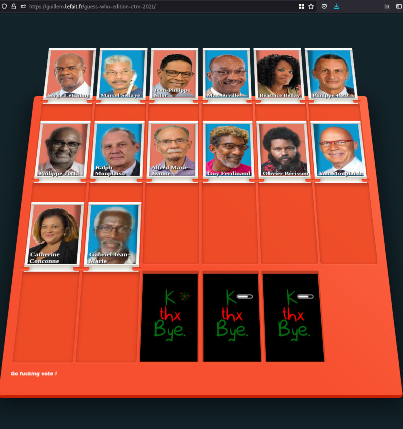

# Guess Who CTM 2021 Edition

Web interface [Guess Who CTM 2021 Edition](https://guillem.lefait.fr/guess-who-edition-ctm-2021/) 

## Choisir un candidat ?
En plus de [critères objectifs](https://github.com/glefait/ctm-elections-2021) , une petite visualisation pour faire un choix.

 

## Mises à jour
Candidats, si vous m'envoyez une photo de meilleure qualité, je ferais les modifications.

## Original author and work
- Author: [@ruidovisual_](https://twitter.com/ruidovisual__)
- Original URL: [codepen.io/ruidovisual/pen/KoRgGR](https://codepen.io/ruidovisual/pen/KoRgGR).

## Changes
- adapt theme
- use a line of pictures to simplify coordinates

## Todo
I'm open to collaboration (really, just ask). Obviously, design / front are not my major ;).

Expected todo list: 
- [ ] use objective criteria to down vote some candidates
- [ ] refactor grid system to simplify board creation and adaptation

